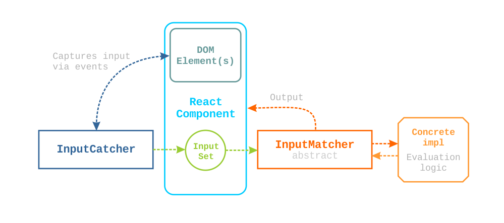

# input-matcher

_Input matcher_ is a mechanism for evaluating the similarity between user inputs like mouse clicks, key presses, dragging. It first captures the input, then performs matching. The output - a coefficient of how similar are the inputs.

- [How To?](#how-to)
- [Code Structure](#code-structure)
- [How It Works](#how-it-works)
- [The Matcher](#the-matcher)

### How To?

```bash
# Install npm dependencies
npm install

# Run the React app
npm start

# Run the tests
npm test

# Generate a documentation (in docs/) with typedoc
npm run docs
```

### Code Structure

We will look into **src** folder:

- **ui/** - is a small React app tasked to show the capabilities of the input matcher
- **core/** - represents the capturing/matching logic
  - **matcher/** - contains matcher logic
    - **AbstractInputMatcher.ts** - contains `AbstractInputMatcher` which describes matcher's properties and behavior
    - **InputMatcher.ts** - contains `InputMatcher`; it's a concrete implementation of the above
    - **Matcher.ts** - sort of a factory (`getMatcher`) that provides an instance of `AbstractInputMatcher` accross the app
  - **tests/** - no need of explanation
  - **utils/**
    - **Parser.ts** - has the logic of the parser and stringifier of input (`parseSet` and `stringifySet`); the string format is suitable for transportation FE-BE
  - **index.ts** - Simple facade (a.k.a. barrel) of the core
  - **InputCatcher.ts** - contains `InputCatcher`; the logic behind capturing of the input from the DOM
  - **InputTypes.ts** - contains all standardized types for clicks, movements, the set, etc.

### How It Works

The scheme describes the idea behind the input matcher. Note that the React app is there just for the demo. The core is framework-agnostic.



The `InputMatcher` and `InputCatcher` don't know about the existance of each other. They are completely decoupled. The `InputCatcher` provides DOM events to the UI with which it can listen for the input. The generated `InputSet` is then passed to the `InputMatcher` which performs the comparison. **In the scheme, we assume that the `InputMatcher` has already accepted a training set(s).**

### The Matcher

Currently, the most important part of the project is still not implemented. Anyway, the idea is to:

- Use pattern recognition algorithm for each `MouseMove` ([k-NN](https://en.wikipedia.org/wiki/K-nearest_neighbors_algorithm); Simple, yet effective)
- Determine if the clicks are within a specific radius for each `MouseClick` (Point in circle; How close to radius)
- Perform approximate string matching for each `KeyPress` sequence ([Damerau–Levenshtein distance](https://en.wikipedia.org/wiki/Damerau%E2%80%93Levenshtein_distance); Improvement of Levenshtein that'll work for us)

So far, these are some common techniques. Here arises:

**Problem 1.** "How are we going to make all of these work together?". The possible solution:

Each algorithm will return a rate between **0** and **1** separately. Let's say we have:

Training set:

```
[ Click A, Move B, Click C, PressSeq D ]
```

Input set:

```
[ Click X, Move Y, Click Z, PressSeq N ]
```

and `A != X`, `B ~ Y`, `C = Z`, `D ~ N`, then after comparison, we can end up with:

```javascript
[ 0.1, 0.88, 1, 0.74 ] // Random numbers for the demo
```

In the end we can simply take the average of the array above and conclude that we have **68%** similarity. This looks promising but then we encounter:

**Problem 2.** "Sequentiality - how we can tackle it?"

What if the input set is like that:

```
[ Move Y, Click X, Click Z, PressSeq N ]
```

We can't compare `A` and `Y` because they are different types. Even if they were the same type, we can't be sure if the `A` is intended to represent/replicate `Y`. That's why we should check the nearby actions as well. Targetting the neighbors hence `n - 1`, `n` and `n + 1`, appears to be reasonable. Anything farther from this can be considered as a deviation from the original input, so for example, it won't matter if `n` resembles `n + 3` or not.

Since now we have to take in count the positions of the actions too, the scalar output array with coefficients won't work.
